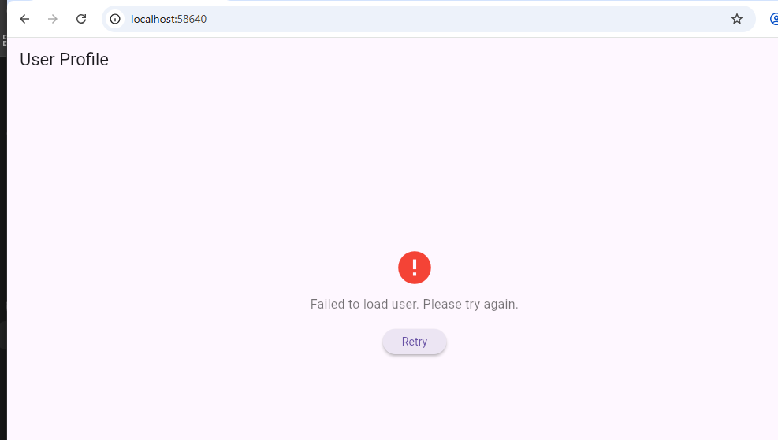

 *ProfileApp
*ProfileApp is a simple Flutter application that fetches a single user profile from a REST API and displays it in the UI.

*Features
*REST API integration using http package
*JSON parsing and mapping into a Dart model

*Profile Screen with:
*Name
*Email
*Phone

*Profile Picture
*Loading indicator while fetching data
*Error handling for failed API requests

*API Used
*User Data: JSONPlaceholder
*Profile Picture: Pravatar

## Screenshots
### Profile Screen

